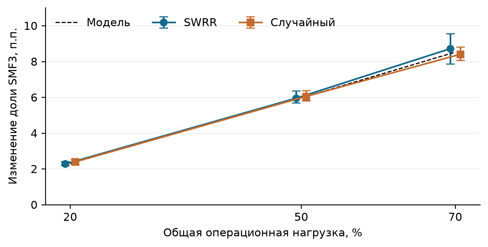
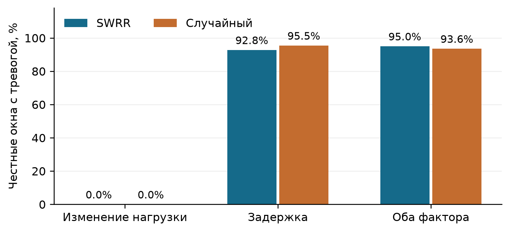
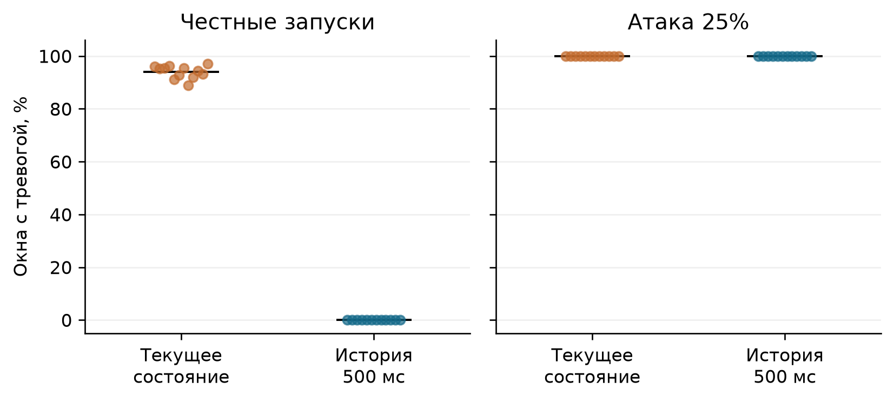

# Независимая проверка нагрузки SMF в ядре 5G с учётом округления и задержки отчётов

Исследовательская статья · редакция от 7 октября 2026 года

## Аннотация

Исследуется фальсификация нагрузки функции управления сессиями SMF при выборе обслуживающего узла в ядре 5G. Предлагается проверка согласованности отчёта с числом сессий, независимо восстановленным по событиям посредника SCP. Для целочисленных отчётов учитывается округление, а для запаздывающих сообщений используется диапазон наблюдавшейся нагрузки за ограниченный интервал прошлого. Эксперимент проведён на модифицированном Open5GS v2.8.0 с UERANSIM v3.2.7. В основную сводку включены 183 пригодных запуска, содержащих 561 960 измеряемых установлений сессий. В 30 парных сравнениях занижение нагрузки вдвое увеличило долю назначений атакующему SMF в среднем на 2,27–8,71 процентного пункта в зависимости от нагрузки и алгоритма выбора. Простое сравнение с текущим состоянием SCP оказалось неустойчивым: при задержке доставки около 201 мс ложные тревоги возникали в среднем в 92,8–95,5% окон без изменения общей численности сессий. После введения истории длительностью 500 мс независимая серия из 24 запусков дала 0 тревог в 1558 честных окнах и тревоги во всех 1558 окнах атаки с занижением на 25%. Результат ограничен проверенными условиями, доверенной шкалой ёмкости, полным наблюдением SCP и общей временной шкалой. Детектор оценён посредством причинного воспроизведения журналов; его промышленное развёртывание не исследовано.

Ключевые слова: ядро 5G, SMF, NRF, SCP, достоверность нагрузки, выбор сетевой функции, обнаружение атак, временное согласование.

## 1. Введение

В сервисной архитектуре ядра 5G сведения о сетевых функциях доступны через NRF. Стандарт TS 29.510 описывает регистрацию, обновление и обнаружение функций, включая поля priority, capacity и load [1]. Если алгоритм назначения учитывает заявленную нагрузку, скомпрометированная функция может изменить собственный отчёт и тем самым повлиять на последующие назначения. Здесь исследуется именно такое допустимое по формату, но недостоверное по содержанию сообщение.

Цель работы состоит в проверке трёх гипотез. Во-первых, занижение load способно систематически увеличить долю новых сессий у атакующего SMF при явно заданной взвешенной политике. Во-вторых, наблюдение успешных операций через SCP даёт независимую основу для проверки отчёта. В-третьих, при сравнении необходимо учитывать и дискретность load, и возраст сообщения: иначе обычные изменения состояния становятся источником ложных тревог.

Вклад работы включает воспроизводимую реализацию причинной цепочки SMF → NRF → AMF, парную оценку смещения назначений и последовательное исследование трёх вариантов детектора. Отрицательные результаты представлены вместе с положительными: выявлены ложные тревоги из-за округления и транспортной задержки. Доработки проверены на новых начальных значениях генератора; данные, использованные для их выбора, не объявляются независимым подтверждением.

<!--pagebreak-->

## 2. Контекст и модель угроз

### 2.1. Связь со стандартами и смежными работами

TS 29.510 задаёт операции управления профилем и обнаружения NF; TS 29.500 описывает техническую реализацию сервисной архитектуры [1, 2]. В данной работе формула веса и алгоритмы выбора являются исследовательскими решениями. Наличие одноимённых атрибутов в стандарте не означает, что стандарт предписывает используемый здесь способ расчёта веса.

Смежные исследования рассматривают безопасность веб-технологий ядра 5G, уязвимости открытых реализаций и атаки через PFCP [5–7]. Работа [5] исследует поверхность атак, связанную с веб-технологиями сервисных интерфейсов. Работа [6] оценивает уязвимости открытых реализаций функций ядра. В [7] рассмотрено нарушение связи посредством PFCP-атак. Наш эксперимент сосредоточен на семантической согласованности отчёта о нагрузке с независимо наблюдаемыми сессиями. Из этого сопоставления не следует утверждение о первенстве метода или полный охват литературы по безопасности 5G.

### 2.2. Возможности атакующего и доверенные компоненты

Атакующий контролирует SMF3 из трёх обслуживающих SMF. Он изменяет поле load собственного отчёта, продолжая обслуживать сессии. NRF, AMF, SCP, генератор UE и журналы наблюдения считаются доверенными. Независимый счётчик SCP не использует значение числа сессий, сообщённое атакующим SMF. Метрика sessionnbr и внутренние записи SMF применяются только при проверке качества и разметке.

Предполагаются известные абсолютные операционные ёмкости SMF и полнота наблюдения соответствующих операций через SCP. Компрометация наблюдателя, обход SCP, потеря событий и подмена доверенной конфигурации ёмкости находятся за пределами модели. Эксперимент не измеряет перехват пользовательского трафика, ухудшение пропускной способности или отказ в обслуживании. Изменение доли назначений само по себе не доказывает эти последствия.

### 2.3. Стенд

Использованы Open5GS v2.8.0, commit 157f611a530e292e40ec50f9d23f0ef5d4fcd6a6, и UERANSIM v3.2.7, commit 1d1e154f869260b5e98f6905827b1bd9b8663afc [3, 4]. Каждая копия стенда содержит три SMF, NRF, SCP, AMF, UPF, вспомогательные функции ядра, MongoDB, Prometheus и эмулируемые gNB/UE. У SMF одинаковы DNN, S-NSSAI и TAI; адресные пулы разделены.

Четыре копии выполнялись на одном компьютере в раздельных сетевых пространствах и базах данных с непересекающимися наборами по четыре CPU. Включённые 183 запуска имеют одинаковый набор хешей измерительных бинарных файлов AMF, SMF, NRF и SCP. Все временные сопоставления внутри запуска используют общие монотонные часы. Совместное использование хоста ограничивает переносимость измерений задержки.

На стенде реализованы операционный счётчик SMF, применение PATCH /load в NRF, свежее обнаружение и взвешенный выбор в AMF, регистрация событий SCP. SBI-контексты проходят через SCP, управление профилем NF направляется в NRF напрямую либо через выделенный посредник задержки. Это модифицированная экспериментальная конфигурация; результаты не являются доказательством аналогичного поведения штатного Open5GS.

<!--pagebreak-->

## 3. Модель нагрузки и независимая проверка

### 3.1. Отчёт и выбор SMF

Абсолютная ёмкость C задаёт операционную шкалу числа сессий, а не измеренный аппаратный предел. При числе активных контекстов N опорная нагрузка равна min(100, 100N/C). Атакующий сообщает целую часть этой величины, умноженной на (1 − α). Для честного узла α = 0; основные воздействия соответствуют α = 0,5 и α = 0,25.

$$L_i^{ref}=\min(100,100N_i/C_i),\qquad L_i^{rep}=\lfloor(1-\alpha_i)L_i^{ref}\rfloor.$$

После фильтрации подходящих SMF и приоритета вес равен capacity × (100 − load). Поле capacity является относительным весом профиля; оно не тождественно абсолютной ёмкости C. В основных сериях capacity = 100. Проверены сглаженный взвешенный циклический выбор SWRR и случайный выбор с вероятностями, пропорциональными весам. Реализация обработки вырожденных весов сохранена в патчах; выводы относятся к наблюдаемым режимам.

Целевой эффект ΔS измеряется как разность долей успешных назначений SMF3 между атакующим и честным запуском одной пары. Условия пары совпадают по начальному значению генератора, сборкам, нагрузке, рабочему контейнеру и параметрам исполнения. Пара различается α. Парные сравнения отделены от серий, предназначенных для оценки детектора.

### 3.2. Восстановление состояния по SCP

Наблюдатель увеличивает счётчик при успешном CreateSMContext, сохраняет идентификатор контекста и уменьшает счётчик при подтверждённом освобождении, включая уведомления RELEASED. Оценка нагрузки вычисляется по восстановленному числу контекстов и доверенной C. Сообщения SMF о собственном числе сессий в признаки не входят. Сопоставление NF-ID с узлом выполняется по лабораторному реестру идентичностей.

Первый детектор использует абсолютную разность целочисленного отчёта и дробной оценки SCP. Второй предварительно округляет оценку SCP вниз. Во всех последующих проверках порог фиксирован и равен нулю: тревога возникает при строго положительном рассогласовании.

$$q(t)=\lfloor\min(100,100\widehat N(t)/C)\rfloor,\qquad d_q(t)=|L^{rep}(t)-q(t)|.$$

### 3.3. Учёт возраста отчёта

В момент получения отчёта NRF наблюдатель берёт минимум и максимум q на интервале последних H = 500 мс. Учитывается также состояние на левой границе. Оценка равна расстоянию отчёта до этого диапазона; будущие события не используются.

$$a(t)=\min_{u\in[t-H,t]}q(u),\quad b(t)=\max_{u\in[t-H,t]}q(u).$$
$$d_H(t)=\max\{a(t)-L^{rep}(t),\ L^{rep}(t)-b(t),\ 0\}.$$

Правило проверяет совместимость с недавним состоянием, а не устанавливает истинный момент измерения. Доверенная граница H выбрана как инженерное допущение для задержки 200 мс и зафиксирована до независимой проверки. Временные метки и версии атакующего SMF не входят в оценку. Если фактический возраст выходит за H или счётчик SCP неполон, отсутствие ложных тревог не гарантируется. Расширение H также может скрывать слабое искажение внутри допустимого диапазона.

<!--pagebreak-->

## 4. Дизайн эксперимента и контроль качества

В каждом стандартном запуске выполнялись начальное заполнение, 300 циклов прогрева и 3000 измеряемых циклов замены сессии. Генератор освобождает один контекст и создаёт другой; проверяется подтверждение UE. В основной серии число активных сессий равно 60, 150 или 210 при трёх C = 100, что соответствует общей операционной нагрузке 20%, 50% и 70%.

| Серия | Пригодных запусков | Измеряемых установлений | Назначение |
|---|---:|---:|---|
| Основная | 60 | 180 000 | 30 пар; α = 0 и 0,5 |
| Калибровка и слабая атака | 27 | 81 000 | 9 честных калибровочных и 18 при α = 0,25 |
| Устойчивость | 24 | 72 000 | Heartbeat 5 с, C₃ = 70, периодическая атака |
| Проверка округления | 12 | 36 000 | Новые повторы при C₃ = 70 |
| Задержка и изменение нагрузки | 36 | 116 640 | Задержка, ступени и их сочетание |
| Проверка учёта истории | 24 | 76 320 | Новые повторы для d_H |
| Всего | 183 | 561 960 | Без пилота и проверочных запусков |

Общее число успешных установлений с начальным заполнением и прогревом равно 643 440. Оно не является числом независимых статистических наблюдений. В основной серии выполнено пять пар на сочетание алгоритма и нагрузки, в последующих проверках обычно три запуска на условие. Одни и те же seed используются в разных условиях серии, поэтому независимость между всеми сочетаниями не предполагается.

Основные seed: 101–105; калибровка: 201–203; слабая атака: 301–303; устойчивость: 401–403; проверка округления: 501–503; задержка и ступени: 701–703; независимая проверка истории: 1001–1003. Пилотные кампании и незавершённые попытки не объединяются с итоговыми когортами.

В основной серии порядок честного и атакующего запусков меняется по чётности seed. Во вторичных сериях применяется фиксированный документированный порядок; полная рандомизация по времени отсутствует. Возможный дрейф общей системы относится к ограничениям. После пяти пар на условие оценивалась точность ΔS. Все шесть условий достигли принятой полуширины исследовательского bootstrap-интервала менее 1 п.п.; предусмотренный отдельный добор не потребовался.

Калибровочные пороги равны 99-му процентилю оценок на отдельных честных SWRR-запусках. Для residual и residual_quantized он оказался нулевым. Номинальный процентиль не гарантирует 1% ложных тревог на других данных. Данные основной серии при первой оценке детектора являются ретроспективной проверкой; независимые серии округления и истории выполнялись после фиксации соответствующих правил.

Аудит требует завершённого сценария, совпадения числа подтверждений UE и успешных созданий, согласования итогового счётчика SCP с метриками, отсутствия дубликатов, наличия кандидатов и решений выбора, согласования версий SMF → NRF → AMF и отсутствия потерь радиосвязи. Неудачная пара основной серии исключена целиком, включая её успешную честную половину. Неудачный запуск независимой серии истории повторён под новым номером попытки. Ошибка публикации папки одной трассы устранена без повторного измерения; после восстановления трасса прошла аудит.

<!--pagebreak-->

## 5. Смещение назначений при занижении нагрузки

При α = 0,5 доля новых назначений SMF3 возрастала для обоих алгоритмов во всех трёх режимах нагрузки. В таблице приведены средние парные изменения доли и исследовательские 95% bootstrap-интервалы по пяти парам; единица измерения — процентный пункт.

| Нагрузка | SWRR: ΔS [интервал] | Случайный выбор: ΔS [интервал] | Стационарная модель |
|---|---|---|---|
| 20% | 2,27 [2,19; 2,42] | 2,39 [2,27; 2,52] | 2,29 |
| 50% | 5,95 [5,69; 6,35] | 6,05 [5,80; 6,37] | 5,96 |
| 70% | 8,71 [7,87; 9,56] | 8,40 [8,07; 8,82] | 8,52 |

Для интерпретации использована ненасыщенная стационарная модель одинаковых ёмкостей. При доле атакующего узла s, одинаковой ожидаемой длительности сессий и нормированной общей нагрузке ρ равновесие весов приводит к уравнению a s² + (3 − a)s − 1 = 0, где a = 3ρα. Положительный корень даёт прогноз ΔS = 100(s − 1/3). Модель не описывает полностью конечную трассу, целочисленное округление и детерминированное расписание SWRR.

$$s=\frac{2}{3-a+\sqrt{(3-a)^2+4a}},\qquad a=3\rho\alpha.$$

Близость измерений к модели поддерживает интерпретацию механизма: более низкий заявленный load увеличивает вес и приток новых сессий. Она не доказывает неизменность эффекта при другой политике discovery, другом времени жизни сессий или иной шкале ёмкости. Узкие интервалы при пяти повторах следует читать как описание наблюдаемой вариабельности, а не как универсальную точность прогноза.

<!--pagebreak-->

## 6. Округление и периодическая атака

При одинаковой C = 100 число сессий непосредственно отображается в целый процент нагрузки. У честного узла с C₃ = 70 оценка SCP становится дробной, тогда как отчёт SMF остаётся целочисленным. При нулевом пороге эта разница вызывала тревоги во всех оценённых окнах шести честных запусков. Предварительное округление вниз снизило среднюю долю тревог до 0,13% по этим шести запускам.

После выбора такого варианта выполнена отдельная серия из 12 запусков при C₃ = 70. В ней применялся неизменный порог; условия и критерии были зафиксированы до запуска. Общая численность 150 соответствует 55,6% суммарной операционной ёмкости 270, поэтому этот режим не обозначается как равномерная нагрузка 50%.

| Независимая проверка C₃ = 70 | SWRR | Случайный выбор |
|---|---:|---:|
| Честные окна: средняя доля тревог | 0% | 0,54% |
| Окна атаки α = 0,25: средняя доля тревог | 100% | 100% |
| Повторов на состояние | 3 | 3 |

Критерии средней доли ложных тревог ≤1% и обнаружения ≥95% выполнены. Для случайного выбора один честный запуск имел 1,61% тревожных окон, хотя среднее по трём запускам было ниже 1%. Поэтому прохождение критерия по среднему не означает выполнение этого предела в каждом запуске.

Периодическая атака исследовалась отдельно в шести запусках: α = 0,25 включалась и выключалась каждые 30 версий нагрузки при секундном heartbeat. Общая доля тревожных окон около 66,5% не трактуется как вероятность обнаружения. При разборе временной разметки были отделены полностью активные, полностью неактивные и переходные окна.

| Категория окна | Всего окон | С тревогой |
|---|---:|---:|
| Полностью активная атака | 246 | 246 |
| Полностью выключенная атака | 252 | 1 |
| Окно пересекает переключение | 252 | 252 |

Все 120 полностью наблюдаемых активных эпизодов были обнаружены. При принятии решения в конце неперекрывающегося 10-секундного окна медианная задержка составила 7,82 с, p95 — 8,40 с, максимум — 8,65 с. Эти значения получены после эксперимента по журналам и не включают доставку журналов или время работы промышленного коллектора. Эпизоды внутри одного запуска зависимы; они не заменяют шесть независимых трасс при оценке неопределённости.

Первое рассогласование в записи NRF наблюдалось через медианные 0,304 мс после формирования первого вредоносного отчёта. Это время появления доступного признака на стенде, а не заявленная задержка онлайн-детектора. Задержка его оконного решения существенно больше.

<!--pagebreak-->

## 7. Проверка задержки и изменений нагрузки

Для проверки временного рассогласования на пути SMF3 → NRF введён отдельный TCP-посредник. Он задерживает каждый прочитанный фрагмент исходящего потока на 200 мс, сохраняет порядок байтов и не добавляет намеренную задержку обратному направлению. Через него проходит также регистрационный обмен SMF3. Это контролируемая задержка потока, а не полная модель сети. Реальная длительность SEND → NRF проверялась по корреляции событий; медианы запусков составили приблизительно 200,69–200,86 мс.

Во второй группе условий численность сессий менялась ступенчато: 210, 90, 150, затем последовательность повторялась. Цели менялись каждые 300 измеряемых циклов; последний блок возвращал число сессий к 150. Создания и освобождения выполнялись последовательными командами UE, поэтому ступень имела ненулевое время перехода. В таких запусках учитывались 360 дополнительных созданий: всего 3360 измеряемых установлений вместо 3000.

| Честный режим | Ложные тревоги d_q, SWRR | Ложные тревоги d_q, случайный |
|---|---:|---:|
| Только изменение численности | 0% | 0% |
| Только задержка | 92,80% | 95,47% |
| Задержка и изменение численности | 95,02% | 93,57% |

Во всех атакующих условиях этой серии d_q срабатывал в 100% оценённых окон. В сочетании с почти постоянными тревогами на честных данных этот показатель не означает полезного распознавания атаки. За время доставки отчёта число сессий успевает измениться. Нулевой порог обнаруживает временное рассогласование так же, как недостоверный отчёт.

По завершении серии зафиксирован вариант d_H с H = 500 мс. При воспроизведении всех 36 известных трасс он дал 0 тревог в честных окнах и тревоги во всех окнах постоянной атаки. Это результат разработки на уже известных условиях. Следующий раздел содержит отдельную проверку на новых seed, проведённую после фиксации формулы и кода.

<!--pagebreak-->

## 8. Независимая проверка учёта истории

В заключительную серию вошли 24 запуска: два режима нагрузки, два состояния атакующего, два алгоритма выбора и три новых seed. Окно истории 500 мс, порог 0 и реализация были зафиксированы до серии. Проверка хешей подтвердила, что сохранённые файлы расчёта и запуска соответствуют этой фиксации.

| Условие | Алгоритм | Ложные тревоги d_q | Ложные тревоги d_H | Обнаружение d_H |
|---|---|---:|---:|---:|
| Задержка | SWRR | 92,81% | 0% | 100% |
| Задержка | Случайный | 94,41% | 0% | 100% |
| Задержка и ступени | SWRR | 92,81% | 0% | 100% |
| Задержка и ступени | Случайный | 96,03% | 0% | 100% |

Здесь доли являются средними по запускам соответствующего состояния. Обнаружение относится к постоянному занижению нагрузки на 25%. Три повтора каждого честного условия и три повтора соответствующего атакующего условия дали одинаковые доли d_H: соответственно 0 и 1. В совокупности было 1558 честных и 1558 атакующих окон; 76 320 измеряемых установлений сессий. Объединённые числа окон приведены описательно, без предположения об их независимости.

Все восемь сочетаний состояния и политики прошли заранее заданные эмпирические критерии: средняя доля тревог на честных данных ≤1%, на атакующих ≥95%. При трёх трассах на условие эти критерии не дают статистической гарантии соответствующей частоты ошибок в эксплуатации. В частности, bootstrap по одинаковым нулевым долям был бы вырожденным; интервал [0; 0] не следует представлять как доказательство нулевого истинного риска.

Результат поддерживает ограниченный вывод: для данного генератора, задержки около 200 мс и α = 0,25 использование диапазона истории устранило наблюдавшуюся причину ложных тревог без потери обнаружения. Не доказано, что эти показатели сохранятся при более слабом искажении, более широком окне истории или неизвестном возрасте отчёта.

<!--pagebreak-->

## 9. Обсуждение и ограничения

Различие между тремя детекторами имеет практический смысл. Исходный residual сравнивает представления разной точности. d_q согласует представление, но сравнивает состояния разных моментов времени. d_H дополнительно допускает согласование с недавней историей. Это даёт последовательное объяснение двух выявленных источников ложных тревог, а не только улучшение одной итоговой метрики.

При точном независимом учёте, верной C, одинаковом округлении и возрасте честного отчёта не больше H соответствующее состояние входит в исторический диапазон. Тогда d_H не должен выдавать тревогу. Данное условное рассуждение не устраняет задержку регистрации событий SCP, ошибку часов или потерю контекстов; на практике они входят в требования к наблюдателю и бюджету времени.

Расширение допустимого диапазона снижает чувствительность. Атакующий, сообщающий значение внутри диапазона последних состояний, может остаться незамеченным. Поэтому H следует задавать на основе доверенной характеристики доставки и наблюдения, а не расширять до исчезновения ошибок на тестовой выборке. Проверка слабых и адаптивных воздействий с таким ограничением остаётся отдельной задачей.

Использованный load является операционной шкалой числа контекстов. Он не измеряет CPU, память, пользовательский трафик или запас производительности. Перенос на иной смысл load требует другой независимой модели. Параметр capacity NFProfile также нельзя проверять одним лишь сравнением load; он представляет отдельную поверхность воздействия, не входящую в подтверждающие серии данной статьи.

Детектор реализован как анализ записанных событий в причинном порядке. Его итоговые оценки не используют будущие события, но задержки доставки журналов, вычислительная стоимость и устойчивость онлайн-коллектора не измерялись. Доверенное получение состояния NRF на промышленном стенде также требует отдельного механизма. Общие монотонные часы внутри контейнера устраняют лабораторную рассинхронизацию, которая возможна между реальными узлами.

Исследовательская политика выбора и изменения Open5GS являются частью экспериментального воздействия. Работа демонстрирует механизм в этой реализации, а не универсальную уязвимость всех ядер 5G. Второе независимое ядро не проверялось. Совместное исполнение четырёх копий на одном хосте и отсутствие полной рандомизации вторичных серий ограничивают внешнюю валидность.

Статистическая единица для интервалов основной серии — парное сравнение в одном условии, для детектора — запуск. Окна внутри трассы зависимы. Используются описательные средние и исследовательские интервалы, а не доказательство заданных эксплуатационных ошибок. Большое число сессий улучшает разрешение внутри запуска, но не заменяет новые независимые окружения.

## 10. Заключение

Занижение load на модифицированном стенде увеличивает долю назначений атакующему SMF; величина эффекта возрастает с операционной нагрузкой и согласуется с простой стационарной моделью. Независимый учёт SCP позволяет проверять содержательную согласованность отчёта, однако прямое сравнение требует учёта округления и возраста данных. Транспортная задержка около 201 мс выявила критическую неустойчивость исходного сравнения. Введение фиксированной истории 500 мс устранило её на отдельной серии из 24 запусков при сохранении обнаружения проверенной атаки. Основной результат работы — экспериментально подтверждённая необходимость согласования точности и времени независимого наблюдения, вместе с воспроизводимым примером такой проверки.

<!--pagebreak-->

## 11. Воспроизводимость и состав материалов

Сводка построена по явному списку пригодных запусков, а не по всем папкам с похожими именами. Сопоставлены записи контроллеров, manifest и сохранённые результаты аудита: число подтверждённых и ожидаемых сессий, объём измеряемой части, итоговые проверки и хеши бинарных файлов. При финальном сведении не выполнялся заново полный разбор всех сырых трасс; сохранённые проверки дополнены контролем состава выборок и совпадения зафиксированного кода заключительной серии.

Каталог results/article-final-20261007 содержит selected-runs.csv, cohorts.csv, effects.csv, detector-comparison.csv, excluded-attempts.json и summary.json. В selected-runs.csv перечислены 183 запуска с параметрами и хешем manifest. Этот хеш не заменяет контрольную сумму каждого сырого файла. Неудачные попытки и пилот сохраняются отдельно; исключённая честная половина неполной пары не возвращается в основную оценку.

Сырые журналы, PCAP, конфигурации, контрольные метрики и последовательности команд UE находятся в runs. Файлы протоколов лежат в каталогах соответствующих серий results. Патчи Open5GS и UERANSIM расположены в patches; описание сборки - в Dockerfile и compose.yaml. Материалы доступны в локальном рабочем каталоге. Публичный архив и DOI в рамках этой работы не опубликованы.

Для повторного сведения без запуска стенда используется команда python scripts/consolidate_article.py. Причинный расчёт исторического диапазона находится в scripts/age_aware_detector.py; параметры независимой проверки - в scripts/timeaware_stage.py. Скрипты запуска стенда изменяют выделенные лабораторные контейнеры и должны выполняться только в предназначенном для них изолированном окружении. Сведения о структуре пакета и версиях включены в отдельный файл REPRODUCIBILITY.md.

## Литература

[1] ETSI. TS 129 510 V16.10.0, 2022. 5G System; Network function repository services; Stage 3. Разделы NFUpdate, NF Heart-Beat, NFDiscover и NFProfile. [Текст спецификации](https://www.etsi.org/deliver/etsi_ts/129500_129599/129510/16.10.00_60/ts_129510v161000p.pdf).

[2] ETSI. TS 129 500 V16.13.0, 2023. 5G System; Technical Realization of Service Based Architecture; Stage 3. [Текст спецификации](https://www.etsi.org/deliver/etsi_ts/129500_129599/129500/16.13.00_60/ts_129500v161300p.pdf).

[3] Open5GS. Release v2.8.0. Версия, использованная как основа модифицированного стенда. [Релиз и исходники](https://github.com/open5gs/open5gs/releases/tag/v2.8.0).

[4] UERANSIM. Release v3.2.7; документация Usage. [Релиз](https://github.com/aligungr/UERANSIM/releases/tag/v3.2.7), [документация](https://github.com/aligungr/UERANSIM/wiki/Usage).

[5] Penetration Testing of 5G Core Network Web Technologies. 2024. arXiv:2403.01871. [Публикация](https://arxiv.org/abs/2403.01871).

[6] A Vulnerability Assessment of Open-Source Implementations of Fifth-Generation Core Network Functions. Future Internet, 2024, 16(1), 1. [Публикация](https://www.mdpi.com/1999-5903/16/1/1).

[7] Threatening the 5G core via PFCP DoS attacks: the case of blocking UAV communications. EURASIP Journal on Wireless Communications and Networking, 2022. DOI: 10.1186/s13638-022-02204-5. [Публикация](https://link.springer.com/article/10.1186/s13638-022-02204-5).
